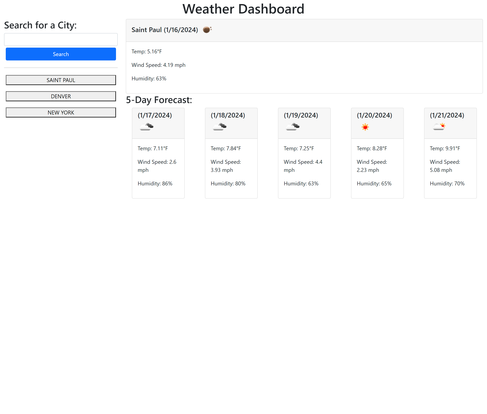

# <Weather Dashboard>

## Description

https://dnoon23.github.io/weather-dashboard/

This project was to create a web page that allowed the user to search a city and get a 6 day forecast.  Today's forecast is displayed at the top of the page and the following 5 days forecasts are displayed smaller below it.  After a city is searched a button is created that allows the user to look up the forecast for that city again.  The most difficult parts of this project was properly displaying the forecast for the following 5 days and getting the buttons created by search the search history to properly seach for the cities they represented.

## Installation

To run the program you have to open index.html in a web browser.

## Usage

To use the webpage the user needs to type in a city in the search text area and select the 'Search' button.  It will then display the forecast information and create a button below the 'Search' button that has the name of that city displayed on it.  The user can then click on that button to re-search the forecast for that city.  Search history persists on reloads so the user can use this feature to quickly check the weather for the same area on different days.

## Credits

APIs taken from: 
https://openweathermap.org/

## Features

Accesses APIs to get information and writes information to the page.  Uses local storage to help create buttons and creates a search history.